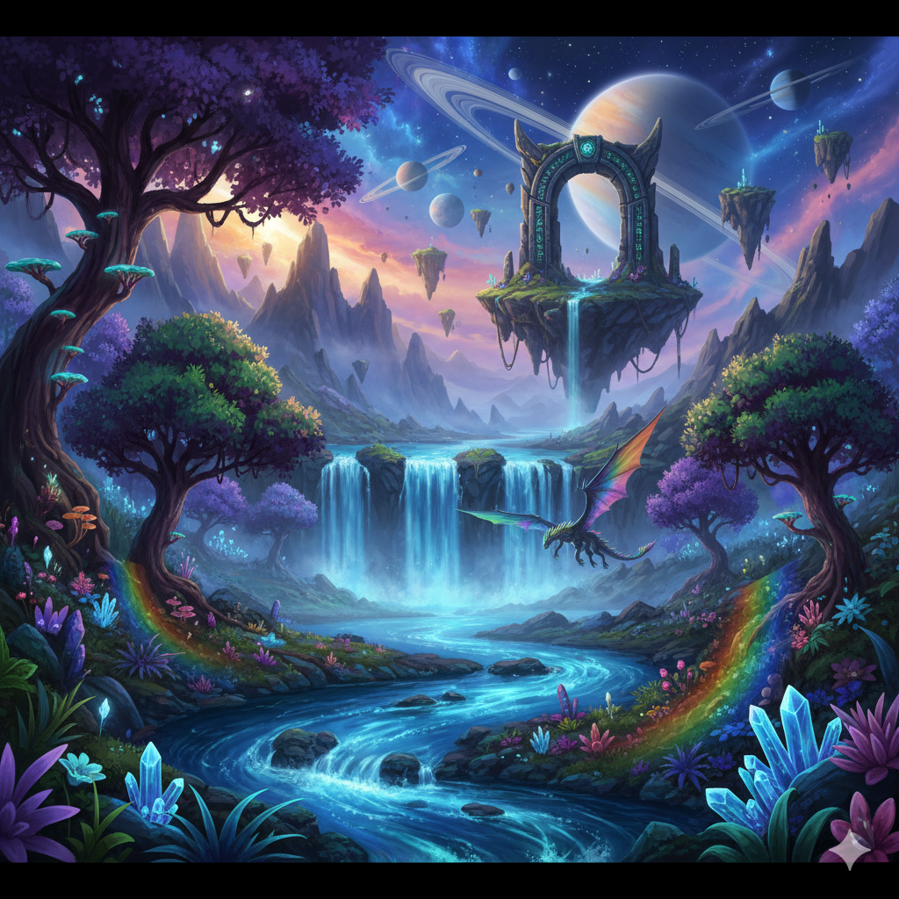

# Terminus

A 3D first-person shooter that runs entirely in your terminal, built with Go and powered by raycasting.

Current status:



## Vision

Terminus is a multiplayer terminal-based FPS inspired by Wolfenstein 3D. Players connect via SSH and experience real-time 3D gameplay rendered using colored ASCII characters and ANSI escape codes. The game features dynamic lighting, projectile physics, and multiple maps - all running at 30 FPS in your terminal.

## Quick Start

```bash
# Build and run
go build
./terminus

# Run with different maps
./terminus maze.map    # Tight corridors
./terminus cave.map    # Open caverns
```

## Controls

- `W/A/S/D` - Move and strafe
- `Q/E` - Turn left/right
- `SPACE` - Shoot fireballs
- `ESC` - Exit

## Current Status

- ✅ **Phase 1 Complete**: Local single-player with raycasting engine, projectile system, and dynamic lighting
- 🚧 **Phase 2 Planned**: SSH multiplayer server
- 🔮 **Phase 3 Future**: Enemies, weapons, and advanced gameplay mechanics

---

*Experience retro FPS gaming reimagined for the modern terminal.*
