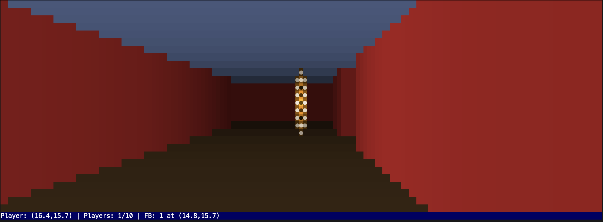

# Terminus

A multiplayer 3D first-person shooter you can play in your terminal. Players connect via SSH to experience real-time multiplayer FPS action with wandering NPCs.

Current status:



## Vision

Terminus is a multiplayer terminal-based FPS inspired by Wolfenstein 3D. Players connect via SSH and experience real-time 3D multiplayer gameplay rendered using colored ASCII characters and ANSI escape codes. The game features dynamic lighting, projectile physics, player visibility, wandering NPCs, and multiple maps - all running at 30 FPS in your terminal.

## Quick Start

```bash
# Build and run SSH server
go build
./terminus                # Default maze.map on port 2222
./terminus cave.map       # Open caverns map

# Connect from another terminal
ssh -p 2222 localhost
```

## Controls

- `W/A/S/D` - Move and strafe
- `Q/E` - Turn left/right
- `SPACE` - Shoot fireballs (visible to all players)
- `ESC` - Exit

## Multiplayer Features

- **SSH Server**: Connect via `ssh -p 2222 localhost`
- **Player Sprites**: See other players as large green `@` symbols
- **Shared Projectiles**: Fireballs shot by any player are visible to all
- **Wandering NPCs**: Blue `◐` sprites that move randomly around the map
- **Up to 10 Players**: Concurrent multiplayer support

## Current Status

- ✅ **Phase 1 Complete**: Local single-player with raycasting engine, projectile system, and dynamic lighting
- ✅ **Phase 2 Complete**: SSH multiplayer server with player visibility and shared world
- ✅ **Phase 3 Complete**: NPC system with wandering AI and multiplayer synchronization
- 🔮 **Future Enhancements**: Combat system, advanced enemies, and interactive elements

## Technical Features

- **Raycasting Engine**: True 3D perspective with Z-buffer depth testing
- **Dynamic Lighting**: Fireballs cast light on nearby walls
- **Sprite System**: Players, NPCs, and projectiles rendered as 3D sprites
- **Thread-Safe**: Proper mutex protection for multiplayer state
- **Real-Time**: 30 FPS gameplay with delta-time movement
- **Map System**: Support for multiple map layouts
